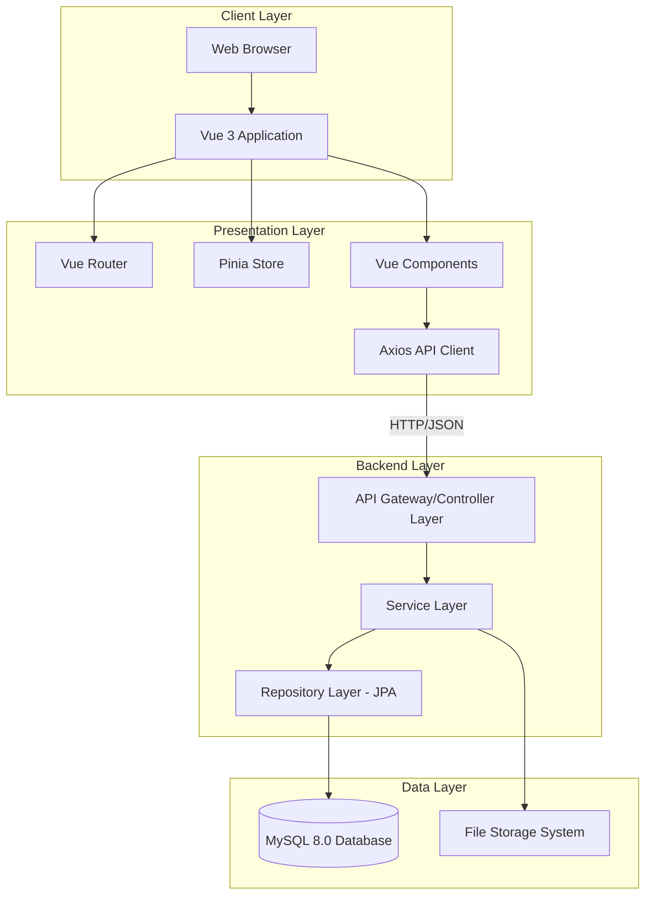
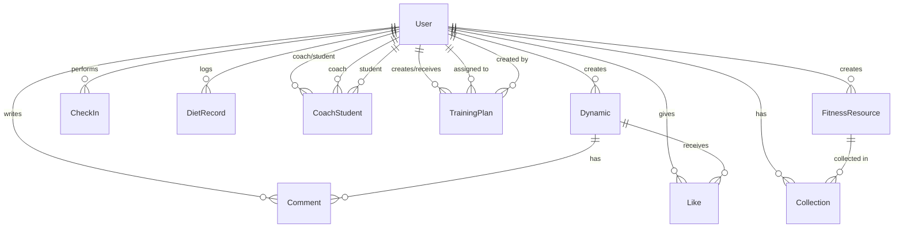
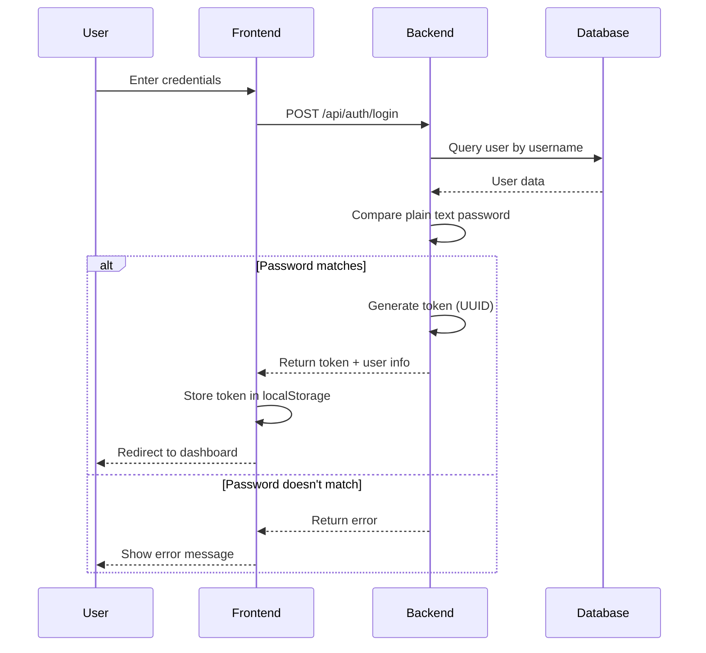

# Design Document

## Overview

The Little Shark Fitness Management System is a full-stack web application built using a modern three-tier architecture with clear separation between presentation, business logic, and data persistence layers. The system follows a RESTful API design pattern with a Spring Boot backend and Vue 3 frontend, connected through HTTP/JSON communication.

### Key Design Principles

1. **Separation of Concerns**: Clear boundaries between frontend, backend, and database layers
2. **Role-Based Access**: Three distinct user roles with specific permissions and capabilities
3. **Stateless Authentication**: Token-based authentication without session management
4. **RESTful API Design**: Standard HTTP methods and resource-oriented endpoints
5. **Component-Based Frontend**: Reusable Vue 3 components with centralized state management
6. **Simplified Security**: No encryption or complex security frameworks per project requirements

## Architecture

### System Architecture Diagram



### Technology Stack

**Backend:**
- Spring Boot 2.7+ (Web, Data JPA)
- Maven for dependency management
- Lombok for boilerplate reduction
- MySQL Connector
- Jackson for JSON serialization

**Frontend:**
- Vue 3 with Composition API
- Vue Router 4 for routing
- Pinia for state management
- Axios for HTTP requests
- Element Plus for UI components

**Database:**
- MySQL 8.0 with UTF8MB4 character set

**File Storage:**
- Local file system storage with configurable upload directory

## Components and Interfaces

### Backend Component Structure

```
com.sharkfitness
├── config/
│   ├── CorsConfig.java              # CORS configuration for frontend
│   ├── FileUploadConfig.java        # File upload settings
│   └── JpaConfig.java               # JPA configuration
├── controller/
│   ├── AuthController.java          # Registration & login endpoints
│   ├── UserController.java          # User profile management
│   ├── ResourceController.java      # Fitness resource CRUD
│   ├── TrainingPlanController.java  # Training plan management
│   ├── DynamicController.java       # Community posts
│   ├── CommentController.java       # Comments on posts
│   ├── CheckInController.java       # Daily check-ins
│   ├── DietRecordController.java    # Diet tracking
│   ├── CoachController.java         # Coach-specific operations
│   ├── AdminController.java         # Admin operations
│   ├── FileUploadController.java    # File upload handling
│   └── SearchController.java        # Search functionality
├── service/
│   ├── AuthService.java
│   ├── UserService.java
│   ├── ResourceService.java
│   ├── TrainingPlanService.java
│   ├── DynamicService.java
│   ├── CommentService.java
│   ├── CheckInService.java
│   ├── DietRecordService.java
│   ├── CoachService.java
│   ├── FileUploadService.java
│   └── SearchService.java
├── service/impl/
│   └── [Implementation classes]
├── repository/
│   ├── UserRepository.java
│   ├── ResourceRepository.java
│   ├── TrainingPlanRepository.java
│   ├── DynamicRepository.java
│   ├── CommentRepository.java
│   ├── CheckInRepository.java
│   ├── DietRecordRepository.java
│   ├── CollectionRepository.java
│   ├── CoachStudentRepository.java
│   └── LikeRepository.java
├── entity/
│   ├── User.java
│   ├── FitnessResource.java
│   ├── TrainingPlan.java
│   ├── Dynamic.java
│   ├── Comment.java
│   ├── CheckIn.java
│   ├── DietRecord.java
│   ├── Collection.java
│   ├── CoachStudent.java
│   └── Like.java
├── dto/
│   ├── LoginRequest.java
│   ├── RegisterRequest.java
│   ├── UserProfileUpdateRequest.java
│   ├── ResourceCreateRequest.java
│   ├── TrainingPlanRequest.java
│   ├── DynamicCreateRequest.java
│   ├── CommentRequest.java
│   ├── DietRecordRequest.java
│   └── SearchRequest.java
├── vo/
│   ├── ApiResponse.java            # Unified response wrapper
│   ├── LoginResponse.java
│   ├── UserVO.java
│   ├── ResourceVO.java
│   ├── TrainingPlanVO.java
│   ├── DynamicVO.java
│   ├── CommentVO.java
│   ├── CheckInStatsVO.java
│   ├── DietSummaryVO.java
│   └── AnalyticsVO.java
├── util/
│   ├── TokenUtil.java              # Token generation and validation
│   ├── FileUtil.java               # File handling utilities
│   └── DateUtil.java               # Date calculation utilities
└── exception/
    ├── GlobalExceptionHandler.java  # Centralized exception handling
    ├── BusinessException.java
    ├── UnauthorizedException.java
    └── ResourceNotFoundException.java
```

### Frontend Component Structure

```
src/
├── api/
│   ├── auth.js                     # Authentication API calls
│   ├── user.js                     # User management
│   ├── resource.js                 # Fitness resources
│   ├── training.js                 # Training plans
│   ├── community.js                # Dynamic posts & comments
│   ├── checkin.js                  # Check-in operations
│   ├── diet.js                     # Diet records
│   ├── coach.js                    # Coach operations
│   ├── admin.js                    # Admin operations
│   ├── upload.js                   # File uploads
│   └── search.js                   # Search functionality
├── views/
│   ├── auth/
│   │   │   ├─
─ Login.vue
│   │   └── Register.vue
│   ├── user/
│   │   ├── Profile.vue
│   │   ├── MyResources.vue
│   │   ├── MyTrainingPlans.vue
│   │   ├── CheckInHistory.vue
│   │   └── DietHistory.vue
│   ├── resource/
│   │   ├── ResourceList.vue
│   │   └── ResourceDetail.vue
│   ├── community/
│   │   ├── CommunityFeed.vue
│   │   ├── PostDetail.vue
│   │   └── CreatePost.vue
│   ├── coach/
│   │   ├── CoachDashboard.vue
│   │   ├── StudentList.vue
│   │   ├── CreateTrainingPlan.vue
│   │   ├── StudentAnalytics.vue
│   │   └── ContentManagement.vue
│   ├── admin/
│   │   ├── AdminDashboard.vue
│   │   ├── UserManagement.vue
│   │   ├── ResourceManagement.vue
│   │   └── ContentModeration.vue
│   └── Home.vue
├── components/
│   ├── common/
│   │   ├── Header.vue
│   │   ├── Footer.vue
│   │   ├── Sidebar.vue
│   │   └── SearchBar.vue
│   ├── resource/
│   │   ├── ResourceCard.vue
│   │   └── ResourceFilter.vue
│   ├── community/
│   │   ├── PostCard.vue
│   │   ├── CommentList.vue
│   │   └── LikeButton.vue
│   ├── training/
│   │   ├── PlanCard.vue
│   │   └── ExerciseList.vue
│   └── charts/
│       ├── CheckInChart.vue
│       ├── ProgressChart.vue
│       └── CalorieChart.vue
├── router/
│   └── index.js                    # Route definitions with guards
├── store/
│   ├── modules/
│   │   ├── auth.js                 # Authentication state
│   │   ├── user.js                 # User profile state
│   │   └── app.js                  # Global app state
│   └── index.js
├── utils/
│   ├── request.js                  # Axios instance with interceptors
│   ├── auth.js                     # Token storage utilities
│   ├── validator.js                # Form validation helpers
│   └── formatter.js                # Data formatting utilities
└── assets/
    ├── styles/
    └── images/
```

### API Endpoint Design

All endpoints follow RESTful conventions and return a unified response format:

```json
{
  "code": 200,
  "msg": "success",
  "data": {}
}
```

**Authentication Endpoints:**
- `POST /api/auth/register` - User registration
- `POST /api/auth/login` - User login
- `POST /api/auth/logout` - User logout

**User Profile Endpoints:**
- `GET /api/users/profile` - Get current user profile
- `PUT /api/users/profile` - Update user profile
- `POST /api/users/avatar` - Upload avatar image

**Fitness Resource Endpoints:**
- `GET /api/resources` - List all resources (with pagination)
- `GET /api/resources/{id}` - Get resource details
- `POST /api/resources` - Create resource (Admin/Coach)
- `PUT /api/resources/{id}` - Update resource (Admin/Coach)
- `DELETE /api/resources/{id}` - Delete resource (Admin)

**Collection Endpoints:**
- `GET /api/collections` - Get user's collections
- `POST /api/collections` - Add to collection
- `DELETE /api/collections/{resourceId}` - Remove from collection

**Training Plan Endpoints:**
- `GET /api/training-plans` - List training plans (filtered by role)
- `GET /api/training-plans/{id}` - Get plan details
- `POST /api/training-plans` - Create plan (Coach)
- `PUT /api/training-plans/{id}` - Update plan (Coach)
- `DELETE /api/training-plans/{id}` - Delete plan (Coach)

**Community Endpoints:**
- `GET /api/dynamics` - List community posts (with pagination)
- `GET /api/dynamics/{id}` - Get post details
- `POST /api/dynamics` - Create post
- `PUT /api/dynamics/{id}` - Update post
- `DELETE /api/dynamics/{id}` - Delete post
- `POST /api/dynamics/{id}/like` - Like a post
- `DELETE /api/dynamics/{id}/like` - Unlike a post

**Comment Endpoints:**
- `GET /api/dynamics/{id}/comments` - Get comments for a post
- `POST /api/comments` - Create comment
- `DELETE /api/comments/{id}` - Delete comment

**Check-In Endpoints:**
- `GET /api/checkins` - Get check-in history
- `POST /api/checkins` - Perform check-in
- `GET /api/checkins/stats` - Get check-in statistics

**Diet Record Endpoints:**
- `GET /api/diet-records` - List diet records (with date filter)
- `POST /api/diet-records` - Create diet record
- `PUT /api/diet-records/{id}` - Update diet record
- `DELETE /api/diet-records/{id}` - Delete diet record
- `GET /api/diet-records/summary` - Get daily summary

**Coach Endpoints:**
- `GET /api/coaches` - List all coaches
- `GET /api/coaches/{id}` - Get coach profile
- `GET /api/coaches/students` - Get coach's students
- `POST /api/coaches/students/{userId}` - Add student
- `DELETE /api/coaches/students/{userId}` - Remove student
- `GET /api/coaches/analytics/{studentId}` - Get student analytics

**Admin Endpoints:**
- `GET /api/admin/users` - List all users
- `PUT /api/admin/users/{id}` - Update user
- `DELETE /api/admin/users/{id}` - Delete user
- `GET /api/admin/moderation` - Get moderation queue
- `POST /api/admin/moderation/{id}/approve` - Approve content
- `POST /api/admin/moderation/{id}/reject` - Reject content

**File Upload Endpoints:**
- `POST /api/upload/image` - Upload image file
- `POST /api/upload/video` - Upload video file

**Search Endpoints:**
- `GET /api/search?q={query}&type={type}` - Search across content types

## Data Models

### Entity Relationship Diagram



### Core Entity Definitions

**User Entity:**
```java
@Entity
@Table(name = "user")
public class User {
    @Id
    @GeneratedValue(strategy = GenerationType.IDENTITY)
    private Long id;
    
    @Column(unique = true, nullable = false, length = 50)
    private String username;
    
    @Column(nullable = false, length = 100)
    private String password;  // Plain text storage
    
    @Column(nullable = false, length = 20)
    private String role;  // user, coach, admin
    
    @Column(length = 255)
    private String avatar;
    
    @Column(length = 10)
    private String gender;
    
    @Column(length = 500)
    private String intro;
    
    @Column(name = "created_at")
    private LocalDateTime createdAt;
    
    @Column(name = "updated_at")
    private LocalDateTime updatedAt;
}
```

**FitnessResource Entity:**
```java
@Entity
@Table(name = "fitness_resource")
public class FitnessResource {
    @Id
    @GeneratedValue(strategy = GenerationType.IDENTITY)
    private Long id;
    
    @Column(nullable = false, length = 200)
    private String title;
    
    @Column(length = 1000)
    private String description;
    
    @Column(name = "content_type", nullable = false, length = 50)
    private String contentType;  // video, article, document
    
    @Column(name = "file_url", length = 500)
    private String fileUrl;
    
    @Column(columnDefinition = "TEXT")
    private String content;  // For text articles
    
    @ManyToOne
    @JoinColumn(name = "creator_id")
    private User creator;
    
    @Column(name = "view_count")
    private Integer viewCount = 0;
    
    @Column(name = "created_at")
    private LocalDateTime createdAt;
    
    @Column(name = "updated_at")
    private LocalDateTime updatedAt;
}
```

**TrainingPlan Entity:**
```java
@Entity
@Table(name = "training_plan")
public class TrainingPlan {
    @Id
    @GeneratedValue(strategy = GenerationType.IDENTITY)
    private Long id;
    
    @Column(nullable = false, length = 200)
    private String name;
    
    @Column(length = 1000)
    private String description;
    
    @Column(columnDefinition = "TEXT")
    private String exercises;  // JSON string of exercise details
    
    @ManyToOne
    @JoinColumn(name = "coach_id", nullable = false)
    private User coach;
    
    @ManyToOne
    @JoinColumn(name = "student_id", nullable = false)
    private User student;
    
    @Column(name = "start_date")
    private LocalDate startDate;
    
    @Column(name = "end_date")
    private LocalDate endDate;
    
    @Column(length = 20)
    private String status;  // active, completed, cancelled
    
    @Column(name = "created_at")
    private LocalDateTime createdAt;
    
    @Column(name = "updated_at")
    private LocalDateTime updatedAt;
}
```

**Dynamic Entity:**
```java
@Entity
@Table(name = "dynamic")
public class Dynamic {
    @Id
    @GeneratedValue(strategy = GenerationType.IDENTITY)
    private Long id;
    
    @Column(columnDefinition = "TEXT", nullable = false)
    private String content;
    
    @Column(name = "image_urls", length = 1000)
    private String imageUrls;  // Comma-separated URLs
    
    @ManyToOne
    @JoinColumn(name = "user_id", nullable = false)
    private User user;
    
    @Column(name = "like_count")
    private Integer likeCount = 0;
    
    @Column(name = "comment_count")
    private Integer commentCount = 0;
    
    @Column(length = 20)
    private String status;  // pending, approved, rejected
    
    @Column(name = "created_at")
    private LocalDateTime createdAt;
    
    @Column(name = "updated_at")
    private LocalDateTime updatedAt;
}
```

**Comment Entity:**
```java
@Entity
@Table(name = "comment")
public class Comment {
    @Id
    @GeneratedValue(strategy = GenerationType.IDENTITY)
    private Long id;
    
    @Column(columnDefinition = "TEXT", nullable = false)
    private String content;
    
    @ManyToOne
    @JoinColumn(name = "user_id", nullable = false)
    private User user;
    
    @ManyToOne
    @JoinColumn(name = "dynamic_id", nullable = false)
    private Dynamic dynamic;
    
    @Column(name = "created_at")
    private LocalDateTime createdAt;
}
```

**CheckIn Entity:**
```java
@Entity
@Table(name = "check_in", 
       uniqueConstraints = @UniqueConstraint(columnNames = {"user_id", "check_date"}))
public class CheckIn {
    @Id
    @GeneratedValue(strategy = GenerationType.IDENTITY)
    private Long id;
    
    @ManyToOne
    @JoinColumn(name = "user_id", nullable = false)
    private User user;
    
    @Column(name = "check_date", nullable = false)
    private LocalDate checkDate;
    
    @Column(name = "check_time")
    private LocalDateTime checkTime;
}
```

**DietRecord Entity:**
```java
@Entity
@Table(name = "diet_record")
public class DietRecord {
    @Id
    @GeneratedValue(strategy = GenerationType.IDENTITY)
    private Long id;
    
    @ManyToOne
    @JoinColumn(name = "user_id", nullable = false)
    private User user;
    
    @Column(name = "meal_type", length = 20)
    private String mealType;  // breakfast, lunch, dinner, snack
    
    @Column(length = 500)
    private String foodItems;
    
    @Column
    private Integer calories;
    
    @Column(name = "meal_date")
    private LocalDate mealDate;
    
    @Column(name = "created_at")
    private LocalDateTime createdAt;
    
    @Column(name = "updated_at")
    private LocalDateTime updatedAt;
}
```

**Collection Entity:**
```java
@Entity
@Table(name = "collection",
       uniqueConstraints = @UniqueConstraint(columnNames = {"user_id", "resource_id"}))
public class Collection {
    @Id
    @GeneratedValue(strategy = GenerationType.IDENTITY)
    private Long id;
    
    @ManyToOne
    @JoinColumn(name = "user_id", nullable = false)
    private User user;
    
    @ManyToOne
    @JoinColumn(name = "resource_id", nullable = false)
    private FitnessResource resource;
    
    @Column(name = "created_at")
    private LocalDateTime createdAt;
}
```

**Like Entity:**
```java
@Entity
@Table(name = "like_record",
       uniqueConstraints = @UniqueConstraint(columnNames = {"user_id", "dynamic_id"}))
public class Like {
    @Id
    @GeneratedValue(strategy = GenerationType.IDENTITY)
    private Long id;
    
    @ManyToOne
    @JoinColumn(name = "user_id", nullable = false)
    private User user;
    
    @ManyToOne
    @JoinColumn(name = "dynamic_id", nullable = false)
    private Dynamic dynamic;
    
    @Column(name = "created_at")
    private LocalDateTime createdAt;
}
```

**CoachStudent Entity:**
```java
@Entity
@Table(name = "coach_student",
       uniqueConstraints = @UniqueConstraint(columnNames = {"coach_id", "student_id"}))
public class CoachStudent {
    @Id
    @GeneratedValue(strategy = GenerationType.IDENTITY)
    private Long id;
    
    @ManyToOne
    @JoinColumn(name = "coach_id", nullable = false)
    private User coach;
    
    @ManyToOne
    @JoinColumn(name = "student_id", nullable = false)
    private User student;
    
    @Column(name = "created_at")
    private LocalDateTime createdAt;
}
```

## Error Handling

### Exception Hierarchy

```java
// Base business exception
public class BusinessException extends RuntimeException {
    private int code;
    private String message;
}

// Specific exceptions
public class UnauthorizedException extends BusinessException {
    public UnauthorizedException(String message) {
        super(401, message);
    }
}

public class ResourceNotFoundException extends BusinessException {
    public ResourceNotFoundException(String message) {
        super(404, message);
    }
}

public class ValidationException extends BusinessException {
    public ValidationException(String message) {
        super(400, message);
    }
}
```

### Global Exception Handler

```java
@RestControllerAdvice
public class GlobalExceptionHandler {
    
    @ExceptionHandler(BusinessException.class)
    public ApiResponse handleBusinessException(BusinessException e) {
        return ApiResponse.error(e.getCode(), e.getMessage());
    }
    
    @ExceptionHandler(Exception.class)
    public ApiResponse handleException(Exception e) {
        return ApiResponse.error(500, "Internal server error");
    }
    
    @ExceptionHandler(MethodArgumentNotValidException.class)
    public ApiResponse handleValidationException(MethodArgumentNotValidException e) {
        String message = e.getBindingResult().getFieldError().getDefaultMessage();
        return ApiResponse.error(400, message);
    }
}
```

### Frontend Error Handling

Axios interceptor for centralized error handling:

```javascript
axios.interceptors.response.use(
  response => {
    const { code, msg, data } = response.data;
    if (code !== 200) {
      ElMessage.error(msg);
      return Promise.reject(new Error(msg));
    }
    return data;
  },
  error => {
    if (error.response) {
      switch (error.response.status) {
        case 401:
          ElMessage.error('Unauthorized, please login');
          router.push('/login');
          break;
        case 403:
          ElMessage.error('Access denied');
          break;
        case 404:
          ElMessage.error('Resource not found');
          break;
        case 500:
          ElMessage.error('Server error');
          break;
        default:
          ElMessage.error('Request failed');
      }
    }
    return Promise.reject(error);
  }
);
```

## Authentication and Authorization

### Authentication Flow



### Token Management

**Token Generation:**
```java
public class TokenUtil {
    public static String generateToken(Long userId) {
        return UUID.randomUUID().toString() + "_" + userId;
    }
    
    public static Long extractUserId(String token) {
        String[] parts = token.split("_");
        return Long.parseLong(parts[1]);
    }
}
```

**Token Storage:**
- Frontend: localStorage with key "auth_token"
- Backend: No server-side storage (stateless)
- Token passed in Authorization header: `Authorization: Bearer {token}`

### Role-Based Access Control

**Backend Implementation:**
```java
@Component
public class AuthInterceptor implements HandlerInterceptor {
    @Override
    public boolean preHandle(HttpServletRequest request, 
                           HttpServletResponse response, 
                           Object handler) {
        String token = request.getHeader("Authorization");
        if (token == null || !token.startsWith("Bearer ")) {
            throw new UnauthorizedException("Missing or invalid token");
        }
        
        Long userId = TokenUtil.extractUserId(token.substring(7));
        User user = userService.findById(userId);
        
        // Store user in request attribute for controller access
        request.setAttribute("currentUser", user);
        return true;
    }
}
```

**Frontend Route Guards:**
```javascript
router.beforeEach((to, from, next) => {
  const token = localStorage.getItem('auth_token');
  const userRole = localStorage.getItem('user_role');
  
  if (to.meta.requiresAuth && !token) {
    next('/login');
  } else if (to.meta.role && to.meta.role !== userRole) {
    next('/unauthorized');
  } else {
    next();
  }
});
```

## File Upload Strategy

### Upload Configuration

**Backend Configuration:**
```java
@Configuration
public class FileUploadConfig {
    @Value("${file.upload.path:/uploads}")
    private String uploadPath;
    
    @Value("${file.max-size.image:5242880}")  // 5MB
    private long maxImageSize;
    
    @Value("${file.max-size.video:104857600}")  // 100MB
    private long maxVideoSize;
    
    @Bean
    public MultipartConfigElement multipartConfigElement() {
        MultipartConfigFactory factory = new MultipartConfigFactory();
        factory.setMaxFileSize(DataSize.ofBytes(maxVideoSize));
        factory.setMaxRequestSize(DataSize.ofBytes(maxVideoSize));
        return factory.createMultipartConfig();
    }
}
```

### File Upload Service

```java
@Service
public class FileUploadService {
    
    public String uploadImage(MultipartFile file) {
        validateImageFile(file);
        String filename = generateUniqueFilename(file.getOriginalFilename());
        String filepath = uploadPath + "/images/" + filename;
        file.transferTo(new File(filepath));
        return "/uploads/images/" + filename;
    }
    
    public String uploadVideo(MultipartFile file) {
        validateVideoFile(file);
        String filename = generateUniqueFilename(file.getOriginalFilename());
        String filepath = uploadPath + "/videos/" + filename;
        file.transferTo(new File(filepath));
        return "/uploads/videos/" + filename;
    }
    
    private void validateImageFile(MultipartFile file) {
        if (file.getSize() > maxImageSize) {
            throw new ValidationException("Image size exceeds 5MB limit");
        }
        String contentType = file.getContentType();
        if (!Arrays.asList("image/jpeg", "image/png", "image/gif")
                   .contains(contentType)) {
            throw new ValidationException("Invalid image format");
        }
    }
    
    private String generateUniqueFilename(String originalFilename) {
        String extension = originalFilename.substring(
            originalFilename.lastIndexOf("."));
        return System.currentTimeMillis() + "_" + 
               UUID.randomUUID().toString() + extension;
    }
}
```

### Frontend Upload Component

```javascript
// Upload utility
export async function uploadImage(file) {
  const formData = new FormData();
  formData.append('file', file);
  
  const response = await axios.post('/api/upload/image', formData, {
    headers: { 'Content-Type': 'multipart/form-data' }
  });
  
  return response.data;  // Returns file URL
}
```

## Testing Strategy

### Backend Testing

**Unit Testing:**
- Test service layer business logic with mocked repositories
- Test utility classes (TokenUtil, FileUtil, DateUtil)
- Test validation logic in DTOs
- Use JUnit 5 and Mockito

**Integration Testing:**
- Test controller endpoints with MockMvc
- Test repository queries with @DataJpaTest
- Test file upload functionality
- Use H2 in-memory database for tests

**Example Test Structure:**
```java
@SpringBootTest
@AutoConfigureMockMvc
class UserControllerTest {
    @Autowired
    private MockMvc mockMvc;
    
    @Test
    void testUserRegistration() throws Exception {
        mockMvc.perform(post("/api/auth/register")
            .contentType(MediaType.APPLICATION_JSON)
            .content("{\"username\":\"test\",\"password\":\"123\",\"role\":\"user\"}"))
            .andExpect(status().isOk())
            .andExpect(jsonPath("$.code").value(200));
    }
}
```

### Frontend Testing

**Component Testing:**
- Test Vue components with Vue Test Utils
- Test user interactions and event handling
- Test computed properties and watchers
- Mock API calls with axios-mock-adapter

**E2E Testing (Optional):**
- Test critical user flows with Cypress
- Test authentication flow
- Test resource browsing and collection
- Test community post creation

## Performance Considerations

### Database Optimization

1. **Indexing Strategy:**
   - Index on User.username for login queries
   - Index on Dynamic.created_at for feed queries
   - Index on CheckIn(user_id, check_date) for check-in lookups
   - Index on Collection(user_id, resource_id) for collection queries

2. **Query Optimization:**
   - Use pagination for list endpoints (default page size: 20)
   - Implement lazy loading for entity relationships
   - Use DTO projections to avoid fetching unnecessary data

3. **Caching Strategy (Future Enhancement):**
   - Cache frequently accessed resources
   - Cache user profile data
   - Cache coach lists

### Frontend Optimization

1. **Code Splitting:**
   - Lazy load route components
   - Split vendor bundles

2. **Asset Optimization:**
   - Compress images before upload
   - Use appropriate image formats
   - Implement lazy loading for images in feeds

3. **State Management:**
   - Cache API responses in Pinia store
   - Implement optimistic UI updates
   - Debounce search inputs

## Deployment Considerations

### Backend Deployment

**Application Properties:**
```properties
# Database
spring.datasource.url=jdbc:mysql://localhost:3306/sharkfitness?useUnicode=true&characterEncoding=utf8mb4
spring.datasource.username=${DB_USERNAME}
spring.datasource.password=${DB_PASSWORD}

# JPA
spring.jpa.hibernate.ddl-auto=update
spring.jpa.show-sql=false
spring.jpa.properties.hibernate.dialect=org.hibernate.dialect.MySQL8Dialect

# File Upload
file.upload.path=/var/uploads
file.max-size.image=5242880
file.max-size.video=104857600

# Server
server.port=8080
```

### Frontend Deployment

**Environment Configuration:**
```javascript
// .env.production
VITE_API_BASE_URL=http://your-backend-domain.com/api
```

**Build Configuration:**
```javascript
// vite.config.js
export default defineConfig({
  base: '/',
  build: {
    outDir: 'dist',
    assetsDir: 'assets',
    sourcemap: false
  }
});
```

### Database Initialization

**Initial Schema:**
- JPA will auto-create tables based on entities
- Character set: UTF8MB4
- Collation: utf8mb4_unicode_ci

**Seed Data:**
- Create default admin account
- Add sample fitness resources
- Populate initial coach profiles

## Security Considerations

While the system intentionally avoids complex security frameworks per requirements, basic security measures include:

1. **Input Validation:**
   - Validate all user inputs on backend
   - Use @Valid annotations on DTOs
   - Sanitize user-generated content

2. **SQL Injection Prevention:**
   - Use JPA parameterized queries
   - Never concatenate user input into queries

3. **XSS Prevention:**
   - Escape user-generated content in frontend
   - Use Vue's built-in XSS protection

4. **File Upload Security:**
   - Validate file types and sizes
   - Generate unique filenames
   - Store files outside web root

5. **CORS Configuration:**
   - Configure allowed origins
   - Restrict to frontend domain in production

## Future Enhancements

Potential improvements for future iterations:

1. **Real-time Features:**
   - WebSocket for live notifications
   - Real-time chat between coaches and students

2. **Advanced Analytics:**
   - Machine learning for personalized recommendations
   - Predictive analytics for training outcomes

3. **Mobile Application:**
   - Native iOS/Android apps
   - Push notifications

4. **Payment Integration:**
   - Subscription management for premium features
   - Coach payment processing

5. **Social Features:**
   - Friend connections
   - Group challenges
   - Leaderboards
