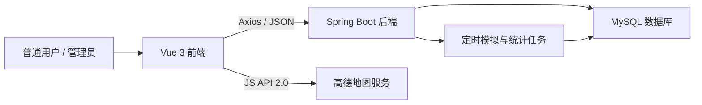
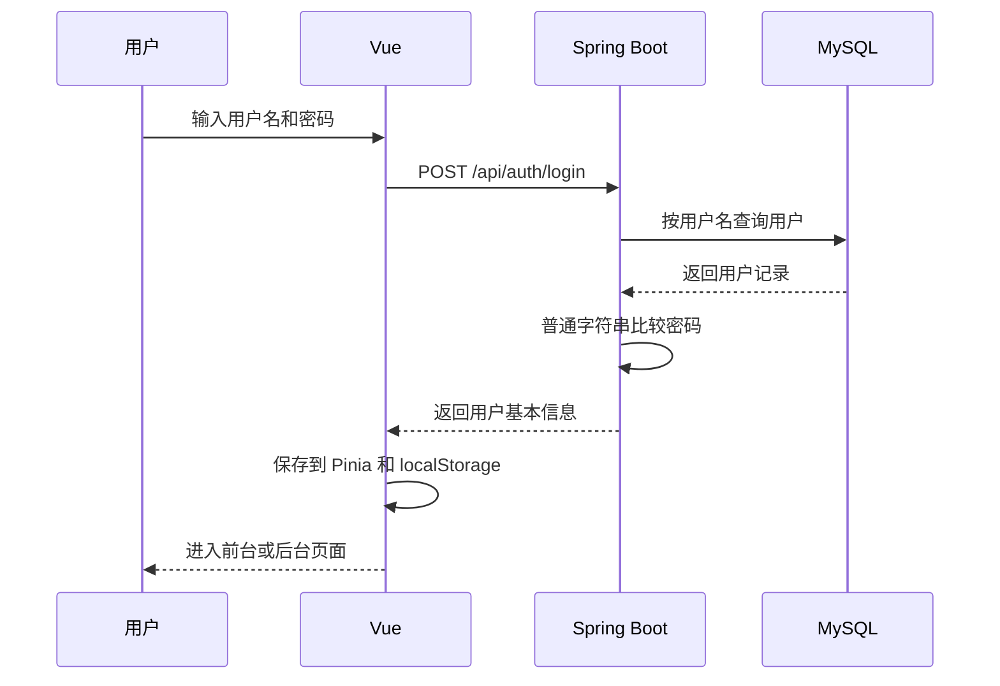

# 汽车充电桩信息与可视化导览平台——开发计划方案

## 1. 文档说明

本文依据《汽车充电桩信息与可视化导览平台_需求与设计方案.docx》整理，并结合高德地图参考页面 `TravelFootprints.vue` 制定可直接执行的开发计划。

项目定位为本科毕业设计或学习练习项目，重点是完整实现“数据库—后端接口—Vue 页面—地图与图表展示”的业务闭环，不追求生产环境级别的安全、并发和部署能力。

### 1.1 确定的开发约束

- 技术栈固定为 Spring Boot + Vue 3 + MySQL。
- 采用前后端分离结构，前端通过 Axios 调用后端 REST 接口。
- 密码按普通字符串保存和比较，不加密、不使用 BCrypt。
- 不使用 JWT，不引入 Spring Security，不实现 Token 拦截器。
- 不进行接口权限校验。前台页面和后台管理页面仅通过路由、菜单和页面入口区分。
- 登录成功后，后端直接返回用户基本信息；前端将用户信息保存到 `localStorage` 或 Pinia 中。
- 高德地图使用给定的 `key` 和 `securityJsCode`，允许将其保存在项目公开的 TXT 配置文件中。
- 不实现真实充电、预约、支付、计费结算、设备控制和真实硬件通信。
- 充电桩实时状态、使用记录和统计数据使用初始化脚本或定时模拟任务生成。
- 本期仅开发 Web 端，不把 Android 客户端列入本计划范围。

### 1.2 项目成功标准

项目最终应形成以下可演示闭环：

1. MySQL 中存在区域、充电站、充电桩、状态、使用记录等完整示例数据。
2. Spring Boot 能够完成登录、查询、统计及后台增删改查。
3. Vue 能展示首页、站点地图、站点详情、区域统计、站内导览、个人中心和后台管理。
4. 高德地图能读取站点经纬度、显示 Marker，并在点击后显示站点摘要。
5. ECharts 能显示区域排行、使用率和时间趋势。
6. 用户能够完成注册/登录、收藏站点和提交反馈；管理员能够维护主要业务数据。
7. 项目有数据库脚本、启动说明、接口测试记录和主要页面截图。

---

## 2. 总体技术方案

### 2.1 技术选型

| 层次 | 技术 | 主要用途 |
| --- | --- | --- |
| 前端 | Vue 3、Vite、Vue Router、Pinia | 页面、路由和简单用户状态管理 |
| UI | Element Plus | 表格、表单、弹窗、分页和消息提示 |
| 网络请求 | Axios | 调用 Spring Boot 接口 |
| 地图 | 高德地图 JS API 2.0、`@amap/amap-jsapi-loader` | 地图加载、站点标记、信息窗体、地址解析 |
| 图表 | ECharts | 区域排行、使用率和趋势图 |
| 后端 | Spring Boot、Spring MVC、MyBatis-Plus | REST 接口、业务逻辑和数据库访问 |
| 数据库 | MySQL 8.x | 保存全部业务数据和统计结果 |
| 开发环境 | JDK 17、Maven、Node.js、npm | 后端和前端构建运行 |
| 测试工具 | Postman/Apifox、浏览器开发者工具 | 接口和页面联调 |

> 简化说明：后端不添加 Spring Security、JWT、Redis、消息队列或微服务组件。除非开发过程中出现明确需求，否则不增加新的基础设施。

### 2.2 总体架构



### 2.3 建议目录结构

```text
汽车充电桩可视化信息平台/
├─ doc/
│  ├─ 汽车充电桩信息与可视化导览平台_需求与设计方案.docx
│  ├─ 开发计划方案.md
│  ├─ 数据库说明.md                 # 第三阶段补充
│  ├─ 接口说明.md                   # 第三阶段补充
│  └─ 运行说明.md                   # 第三阶段补充
├─ springboot/
│  ├─ pom.xml
│  ├─ src/main/java/.../
│  │  ├─ common/                    # Result、分页结果、异常处理
│  │  ├─ controller/
│  │  ├─ service/
│  │  ├─ mapper/
│  │  ├─ entity/
│  │  ├─ dto/
│  │  ├─ vo/
│  │  ├─ config/                    # 跨域、MyBatis-Plus
│  │  └─ task/                      # 模拟状态、每日统计
│  └─ src/main/resources/
│     ├─ application.yml
│     ├─ sql/schema.sql
│     └─ sql/data.sql
└─ vue/
   ├─ public/config/amap.txt
   ├─ package.json
   └─ src/
      ├─ api/
      ├─ assets/
      ├─ components/
      ├─ layout/
      ├─ router/
      ├─ stores/
      ├─ utils/amapConfig.js
      └─ views/
         ├─ home/
         ├─ station/
         ├─ statistics/
         ├─ guide/
         ├─ user/
         └─ admin/
```

---

## 3. 功能范围与取舍

### 3.1 本期必须实现

#### 前台门户

- 首页概览：区域数、站点数、充电桩总数、空闲数、使用中数量、故障数。
- 公告与推荐站点：显示已发布公告和空闲桩较多的站点。
- 区域统计：区域排行、使用率柱状图、每日趋势折线图。
- 站点地图：名称、区域、接口类型、运营状态等筛选；地图与列表联动。
- 站点详情：地址、营业时间、收费说明、配套设施、各状态数量和桩列表。
- 可视化导览：高德地图负责城市级站点位置；站内导览采用二维图片/SVG + 比例坐标点。
- 用户中心：注册、登录、查看/修改基本资料、收藏、取消收藏、反馈记录。
- 公告浏览与意见反馈。

#### 后台管理

- 管理工作台：首页指标、近 7 日趋势、故障桩数量和待处理反馈。
- 用户、区域、充电站、充电桩、实时状态、使用记录的增删改查。
- 区域统计快照、导览点、公告和用户反馈管理。
- 充电站编辑表单支持手工输入经纬度，并可增加“根据地址识别坐标”按钮。

### 3.2 明确不实现

- 密码加密、JWT、Cookie Session、验证码和登录过期机制。
- Spring Security、角色权限、菜单权限、按钮权限和接口鉴权。
- 第三方登录、短信、邮件验证和找回密码。
- 真实支付、预约、充电控制、硬件通信和运营商实时接口。
- 复杂三维 GIS、真实道路路径规划和站内自动寻路算法。
- Redis 缓存、微服务、消息队列和高并发压测。

### 3.3 简化登录流程



登录只用于练习页面流程，不构成安全身份认证。后台接口仍可被直接调用，这一点符合本项目的学习型简化约束。

---

## 4. 数据库实施方案

### 4.1 核心数据表

| 表名 | 作用 | 第一阶段要求 |
| --- | --- | --- |
| `sys_user` | 普通用户和管理员账号 | 保留 `user_type` 仅用于前端入口区分；密码明文保存 |
| `region` | 省、市、区县或自定义区域 | 支持父子层级 |
| `charging_station` | 充电站资料与经纬度 | 经纬度使用 `DECIMAL(10,6)` |
| `charging_pile` | 站点下的充电桩 | 保存接口类型、功率、厂家和启用状态 |
| `pile_realtime_status` | 充电桩当前/历史状态 | 状态：0空闲、1使用中、2预约、3离线、4故障 |
| `charging_usage_record` | 模拟充电记录 | 保存起止时间、时长、电量、费用和状态 |
| `region_statistics` | 每日区域统计快照 | `region_id + stat_date` 唯一 |
| `user_favorite` | 用户收藏站点 | `user_id + station_id` 唯一 |
| `user_feedback` | 意见反馈和管理员回复 | 状态：待处理、处理中、已完成 |
| `guide_point` | 站内导览点 | 保存 `x_ratio`、`y_ratio` 比例坐标 |
| `notice` | 公告与维护通知 | 草稿、发布、下架三种状态 |

不创建 `sys_role` 和 `sys_user_role`，因为本项目不做权限系统。`sys_user.user_type` 仅帮助前端决定显示普通用户首页还是后台菜单。

### 4.2 初始化数据建议

- 6—10 个区域。
- 30—80 个充电站，每个站点保存真实合理的经纬度。
- 每个站点 5—20 个充电桩，总计约 300—800 个。
- 每个站点至少设置 3 个站内导览点，例如入口、快充区、休息区。
- 初始化 30 天左右的使用记录和区域统计快照，保证图表打开后即可展示。
- 至少 2 个普通用户和 1 个管理员账号，密码直接使用便于演示的普通字符串。
- 至少 5 条已发布公告、5 条反馈记录和若干收藏记录。

### 4.3 关键数据规则

- 高德地图坐标统一使用 `[longitude, latitude]`，不得把经纬度顺序写反。
- 充电站删除前检查是否存在充电桩；学习项目中优先提示“请先删除充电桩”，不做复杂级联。
- 充电桩状态查询取该桩 `status_time` 最新的一条记录；也可以在实现时保证每桩只保留一条当前状态。
- 使用率口径统一为 `使用中数量 / 可用充电桩数量 × 100%`。论文和页面使用同一计算口径。
- 收藏表建立 `(user_id, station_id)` 唯一索引，防止重复收藏。
- 区域统计表建立 `(region_id, stat_date)` 唯一索引，防止同一天重复汇总。

---

## 5. 高德地图专项方案

### 5.1 参考实现结论

参考文件：

```text
D:\从E盘移植\项目\Android-VUE-SpringBoot\旅行记忆项目\VUE\src\views\TravelFootprints.vue
```

可直接复用的实现思路包括：

- 使用 `@amap/amap-jsapi-loader` 异步加载 JS API 2.0。
- 在调用 `AMapLoader.load()` 之前设置 `window._AMapSecurityConfig.securityJsCode`。
- 用单例 Promise 防止同一页面重复加载高德地图脚本。
- 在 `onMounted` 初始化地图，在 `onUnmounted` 调用 `map.destroy()`。
- 使用 `AMap.Marker` 展示站点位置，使用 `AMap.InfoWindow` 展示站点摘要。
- 使用 `AMap.Geocoder` 将后台站点表单中的地址识别为经纬度。
- 使用 `ToolBar`、`Scale` 等基础插件，并在数据变化后重新渲染 Marker。

### 5.2 TXT 配置文件

创建文件：`vue/public/config/amap.txt`

```text
key=e2706bc1e334def5699349076d5f6d58
securityJsCode=76805393edb2f03827a55eafa36fc6d2
```

之所以放在 `public/config` 下，是因为浏览器不能直接读取电脑上的任意本地文件，但可以通过前端服务器访问公开静态文件。开发环境和打包后均可请求 `/config/amap.txt`。

建议创建 `vue/src/utils/amapConfig.js`，集中负责读取和解析配置：

```js
let configPromise

export function loadAmapConfig() {
  if (!configPromise) {
    configPromise = fetch('/config/amap.txt')
      .then(response => {
        if (!response.ok) throw new Error('高德地图配置读取失败')
        return response.text()
      })
      .then(text => Object.fromEntries(
        text.split(/\r?\n/)
          .map(line => line.trim())
          .filter(line => line && !line.startsWith('#'))
          .map(line => {
            const index = line.indexOf('=')
            return [line.slice(0, index).trim(), line.slice(index + 1).trim()]
          })
      ))
  }
  return configPromise
}
```

地图初始化的关键顺序：

```js
const config = await loadAmapConfig()

window._AMapSecurityConfig = {
  securityJsCode: config.securityJsCode
}

const AMap = await AMapLoader.load({
  key: config.key,
  version: '2.0',
  plugins: [
    'AMap.ToolBar',
    'AMap.Scale',
    'AMap.Marker',
    'AMap.InfoWindow',
    'AMap.Geocoder'
  ]
})
```

### 5.3 地图页面功能分步

1. 加载 `/api/stations` 返回的站点数组。
2. 读取 TXT 配置并加载高德地图。
3. 根据每个站点的经纬度创建 Marker。
4. Marker 点击后显示站点名、地址、空闲数、运营状态和“查看详情”入口。
5. 左侧列表点击后让地图移动到对应站点并打开信息窗体。
6. 筛选条件变化后重新请求接口、清除旧 Marker 并渲染新结果。
7. 首次加载使用 `setFitView()` 自动调整视野；无数据时显示默认中心点。
8. 管理端站点表单可用 Geocoder 识别地址并回填经纬度。

### 5.4 地图验收点

- TXT 文件可以被浏览器访问和正确解析。
- `securityJsCode` 在加载地图脚本前完成设置。
- 地图加载失败、配置缺失和接口无数据时都有明确提示。
- Marker 数量与当前筛选结果数量一致。
- 经纬度顺序正确，站点位置没有明显漂移到其他城市。
- 反复进入和离开页面不会重复创建地图实例或出现控制台报错。

---

## 6. 接口规划

### 6.1 统一返回格式

```json
{
  "code": 200,
  "message": "success",
  "data": {}
}
```

分页结果：

```json
{
  "records": [],
  "total": 0,
  "pageNum": 1,
  "pageSize": 10
}
```

不设置 401、403 等权限响应。登录失败、参数错误和数据不存在可分别使用统一业务错误信息，前端直接通过 `message` 提示。

### 6.2 主要接口清单

| 模块 | 方法与路径 | 说明 |
| --- | --- | --- |
| 登录 | `POST /api/auth/register` | 普通字符串密码注册 |
| 登录 | `POST /api/auth/login` | 查询用户并直接比较密码 |
| 首页 | `GET /api/home/overview` | 首页核心指标 |
| 首页 | `GET /api/home/recommendations` | 推荐站点 |
| 区域 | `GET /api/regions/tree` | 区域树 |
| 统计 | `GET /api/statistics/regions` | 区域排行与使用率 |
| 统计 | `GET /api/statistics/trend` | 指定区域时间趋势 |
| 站点 | `GET /api/stations` | 条件分页查询 |
| 站点 | `GET /api/stations/{id}` | 站点详情 |
| 站点 | `GET /api/stations/{id}/piles` | 站点桩及状态 |
| 导览 | `GET /api/stations/{id}/guide` | 站内导览点 |
| 收藏 | `GET /api/favorites?userId=...` | 查询用户收藏 |
| 收藏 | `POST /api/favorites` | 请求体传 `userId`、`stationId` |
| 收藏 | `DELETE /api/favorites/{id}` | 取消收藏 |
| 反馈 | `POST /api/feedback` | 提交反馈，直接传 `userId` |
| 反馈 | `GET /api/feedback?userId=...` | 查看个人反馈 |
| 公告 | `GET /api/notices` | 查询已发布公告 |
| 后台 | `/api/admin/users` | 用户管理 CRUD |
| 后台 | `/api/admin/regions` | 区域管理 CRUD |
| 后台 | `/api/admin/stations` | 站点管理 CRUD |
| 后台 | `/api/admin/piles` | 充电桩管理 CRUD |
| 后台 | `/api/admin/status` | 状态管理 CRUD |
| 后台 | `/api/admin/usage-records` | 使用记录管理 CRUD |
| 后台 | `/api/admin/statistics` | 统计快照查询/重新生成 |
| 后台 | `/api/admin/guide-points` | 导览点管理 CRUD |
| 后台 | `/api/admin/notices` | 公告管理 CRUD |
| 后台 | `/api/admin/feedback` | 反馈处理和回复 |

后台接口路径只是为了代码和页面分类，不做权限拦截。

---

## 7. 三阶段开发计划


### 7.1 第一阶段：基础工程、数据库与后端核心

**建议周期：第 1—2 周**

**阶段目标：** 从空目录建立可运行的前后端工程，完成数据库和核心查询接口，使 Postman 可以独立验证主要业务数据。

#### 任务 1：创建工程与公共配置

- 在 `springboot/` 创建 Spring Boot 工程。
- 添加 Spring Web、MyBatis-Plus、MySQL Driver、Validation、Lombok 等必要依赖。
- 配置 `application.yml`、数据库连接、统一时间格式和跨域。
- 创建 `Result<T>`、分页返回对象和统一异常处理。
- 在 `vue/` 创建 Vue 3 + Vite 工程。
- 安装 Vue Router、Pinia、Axios、Element Plus、ECharts 和高德地图加载器。
- 建立前台布局、后台布局、路由和 Axios 基础封装。

#### 任务 2：创建数据库

- 根据第 4 节创建 11 张核心表。
- 编写 `schema.sql` 和 `data.sql`。
- 插入区域、站点、充电桩、状态、公告和用户基础数据。
- 用 SQL 检查主键、唯一索引和关联数据是否正确。

#### 任务 3：实现后端分层

- 为核心表建立 Entity、Mapper、Service、Controller。
- 先完成区域、站点、充电桩、状态和公告接口。
- 实现站点条件查询、站点详情和站点下充电桩状态查询。
- 实现首页指标聚合接口。
- 实现注册和简化登录：数据库明文密码直接比较，返回用户对象。
- 实现统一参数错误和数据不存在提示，不加入安全相关组件。

#### 任务 4：接口自测

- 使用 Postman/Apifox 验证注册、登录、区域树、首页指标、站点分页、详情和桩状态。
- 检查空条件、错误 ID、重复用户名和分页边界。
- 对照 MySQL 查询结果确认接口统计数据正确。

#### 第一阶段交付物

- 可启动的 Spring Boot 和 Vue 基础工程。
- `schema.sql`、`data.sql` 和至少一批可演示数据。
- 核心 Entity/Mapper/Service/Controller。
- 可通过 Postman 验证的登录、首页、区域、站点和公告接口。
- 前端登录页和两个基础布局可以正常切换。

#### 第一阶段验收标准

- 前后端可分别启动，无编译错误。
- MySQL 初始化脚本可在空数据库中一次执行成功。
- 登录成功后前端能保存用户对象；刷新后能从 `localStorage` 恢复。
- `/api/home/overview`、`/api/stations`、`/api/stations/{id}` 返回正确数据。
- 项目中不存在 JWT、Spring Security 或密码加密代码。

### 7.2 第二阶段：前台页面、地图与统计可视化

**建议周期：第 3—4 周**

**阶段目标：** 完成用户可见的核心演示页面，重点打通高德地图、站点详情和 ECharts 统计。

#### 任务 1：首页和公共页面

- 实现顶部导航、首页指标卡片、地图摘要、推荐站点和公告列表。
- 实现公告详情、登录、注册和简单个人资料页面。
- 完成加载中、无数据和接口错误三种通用状态。

#### 任务 2：高德地图站点页面

- 创建 `public/config/amap.txt` 并写入给定配置。
- 实现 `utils/amapConfig.js` 和统一地图加载工具。
- 参考 `TravelFootprints.vue` 初始化地图、工具栏、比例尺、Marker 和 InfoWindow。
- 实现区域、站点名、接口类型和状态筛选。
- 实现地图与站点列表双向联动、自动缩放和点击进入详情。
- 组件卸载时销毁地图实例。

#### 任务 3：站点详情和站内导览

- 展示站点基础资料、营业时间、费用、停车说明和服务设施。
- 展示总桩数、空闲、使用中、离线、故障等状态指标。
- 用 Element Plus 表格展示桩编号、接口、功率、状态和更新时间。
- 使用一张站内平面示意图或 SVG，根据 `x_ratio`、`y_ratio` 定位导览点。
- 右侧显示入口、停车区、快充区、慢充区和服务区的文字导览步骤。

#### 任务 4：区域统计与图表

- 实现区域统计排行、使用率柱状图和每日趋势折线图。
- 添加区域、日期范围和统计指标筛选。
- 窗口尺寸变化时调用 ECharts `resize()`，页面卸载时销毁图表。
- 核对图表值与 `region_statistics` 表一致。

#### 任务 5：用户收藏和反馈

- 实现收藏、取消收藏和收藏列表。
- 请求中直接携带前端保存的 `userId`。
- 实现反馈提交和反馈处理状态查看。

#### 第二阶段交付物

- 门户首页、区域统计、站点地图、站点详情和站内导览页面。
- 高德地图 TXT 配置和统一加载工具。
- 收藏、个人中心、公告和反馈页面。
- 与前端页面对应的查询、统计和用户接口。

#### 第二阶段验收标准

- 高德地图正常加载，筛选后 Marker 和列表数量一致。
- 点击 Marker 可查看站点摘要并进入详情。
- 站点详情中的数量与桩状态列表一致。
- 至少两类 ECharts 图表有真实数据库数据且数值正确。
- 用户登录后可收藏、取消收藏和提交反馈。
- 1366×768 分辨率下主要内容可正常使用，没有明显遮挡或横向溢出。

### 7.3 第三阶段：后台管理、数据模拟、联调与交付

**建议周期：第 5—6 周**

**阶段目标：** 补齐后台数据维护和演示数据自动生成，完成全流程测试、问题修复和毕业设计交付材料。

#### 任务 1：后台通用框架

- 完成顶部栏、左侧菜单、面包屑和内容区。
- 封装通用查询栏、表格、分页、新增/编辑弹窗和删除确认交互。
- 后台菜单包括用户、区域、站点、充电桩、状态、使用记录、统计、导览点、公告和反馈。
- 不实现动态菜单或权限判断；路由和菜单固定配置。

#### 任务 2：后台 CRUD

- 完成所有管理模块的查询、新增、编辑和删除。
- 站点表单加入经纬度输入，并可调用高德 Geocoder 识别地址。
- 新增充电桩时必须选择所属站点。
- 导览点管理支持录入类型、名称和比例坐标。
- 公告支持草稿、发布、下架；反馈支持填写回复并修改处理状态。

#### 任务 3：模拟状态与统计任务

- 使用 Spring `@Scheduled` 定时随机更新充电桩状态。
- 生成合理的模拟使用记录：高峰时段使用率高、故障比例不超过约 5%。
- 提供“重新生成某日统计”接口，便于调试。
- 每日按区域汇总站点数、桩数、各状态数量、使用次数、电量和使用率。
- 为保证答辩稳定，可同时保留固定 SQL 示例数据，不完全依赖定时任务。

#### 任务 4：全流程联调与修复

- 从数据库初始化开始验证前后端完整启动流程。
- 按“登录—首页—筛选地图—站点详情—收藏—反馈—后台处理”的顺序走通演示流程。
- 检查刷新页面、错误 ID、空数据、重复提交、删除有关联数据等情况。
- 检查 Chrome 和 Edge；重点检查地图、图表、弹窗和分页。
- 检查控制台无未处理错误，后端日志无持续异常。

#### 任务 5：整理交付材料

- 编写数据库说明、接口说明和最简运行说明。
- 导出最终 `schema.sql` 和 `data.sql`。
- 保存主要接口测试截图、数据库表截图和页面截图。
- 整理论文可使用的实现说明：技术架构、数据库、核心功能、地图实现、统计实现和测试结果。
- 准备 5—8 分钟稳定演示路线，避免答辩时临时录入大量数据。

#### 第三阶段交付物

- 完整后台管理端及其 CRUD 接口。
- 可控制的充电桩状态模拟和区域统计任务。
- 最终数据库脚本、运行说明、接口说明和测试记录。
- 可用于论文和答辩的主要页面与接口截图。

#### 第三阶段验收标准

- 主要业务表均可通过后台维护。
- 后台修改站点后，前台地图和详情能够看到最新结果。
- 模拟任务能更新状态并生成统计，不出现大量不合理数据。
- 完整演示流程连续执行成功。
- 在一台新电脑按运行说明能够完成数据库初始化、后端启动和前端启动。

---

## 8. 页面开发顺序

为降低返工，页面不要同时全面铺开，建议按数据依赖顺序完成：

1. 登录/注册页：验证用户接口和前端用户状态保存。
2. 前后台基础布局：确定路由和导航结构。
3. 首页：验证聚合指标、推荐站点和公告。
4. 站点地图：验证高德地图、筛选和站点数据。
5. 站点详情：验证站点、充电桩和实时状态关联。
6. 区域统计：验证统计表和 ECharts。
7. 站内导览：验证导览点比例坐标。
8. 收藏、反馈和个人中心：补齐用户闭环。
9. 后台工作台：复用首页统计接口。
10. 后台各 CRUD：先区域，再站点，再充电桩，最后其他模块。

---

## 9. 测试计划

### 9.1 后端接口测试

- 注册：正常注册、用户名重复、必填项为空。
- 登录：正确密码、错误密码、用户不存在、禁用用户。
- 站点：多条件查询、分页、详情不存在、区域过滤。
- 收藏：新增、重复收藏、取消、用户收藏列表。
- 反馈：提交、列表、后台回复、状态变化。
- 管理：各模块新增、修改、删除和有关联数据时的提示。
- 统计：区域汇总、趋势日期范围、重新生成统计。

### 9.2 前端功能测试

- 刷新页面后用户信息能否恢复。
- 接口失败时是否有提示，按钮加载状态是否能恢复。
- 表单必填、数字范围、经纬度范围和删除确认是否有效。
- 地图加载、Marker、InfoWindow、列表联动、反复进出页面是否正常。
- 图表切换筛选条件后是否刷新，页面缩放后是否自适应。
- 表格分页、空数据、长文本、弹窗关闭和表单重置是否正常。

### 9.3 数据核对

- 首页站点数、桩数与数据库记录一致。
- 站点空闲数等于其充电桩最新状态中的空闲数量。
- 区域统计表和 ECharts 展示值一致。
- 收藏、反馈和公告状态变化后前后台结果一致。
- 导览点比例坐标在不同窗口宽度下仍落在正确区域。

### 9.4 不作为重点的测试

- 密码安全、Token 攻击、越权访问和权限隔离测试。
- 大规模并发、压力、容灾和分布式部署测试。

这些内容不属于本学习项目范围，但在论文中应说明系统是教学演示版本，不能直接用于生产环境。

---

## 10. 风险与处理建议

| 风险 | 可能表现 | 处理方式 |
| --- | --- | --- |
| 高德地图配置顺序错误 | 地图白屏或安全密钥报错 | 必须先设置 `window._AMapSecurityConfig`，再调用 Loader |
| TXT 无法读取 | 请求 404、地图不能初始化 | 文件固定放在 `vue/public/config/amap.txt`，使用绝对路径 `/config/amap.txt` |
| 经纬度顺序错误 | Marker 出现在错误城市 | 统一使用 `[longitude, latitude]` |
| 页面重复加载地图 | 控制台报错、插件重复 | 使用单例 Promise，卸载时销毁地图实例 |
| 数据量不足 | 图表和地图演示单调 | 第一阶段准备固定初始化数据，第三阶段补模拟任务 |
| 统计口径不一致 | 首页、图表、数据库数字不同 | 固定使用率公式，并让接口统一调用同一统计逻辑 |
| 模块过多导致延期 | 后台 CRUD 尚未完成 | 先保证地图、详情和统计闭环，再补低优先级管理功能 |
| 简化登录被误认为生产设计 | 论文评审质疑安全性 | 在系统边界中明确说明仅限学习演示，不用于真实运营 |

---

## 11. 最终完成检查清单

### 工程与数据库

- [ ] `springboot/` 和 `vue/` 均可独立启动。
- [ ] 数据库脚本能在空库中完整执行。
- [ ] 11 张核心表、索引和示例数据齐全。
- [ ] 项目未引入 JWT、Spring Security 和密码加密。

### 前台功能

- [ ] 首页指标、推荐站点和公告正常。
- [ ] 区域统计和趋势图数据正确。
- [ ] 高德地图、Marker、InfoWindow 和筛选联动正常。
- [ ] 站点详情、桩状态和站内导览正常。
- [ ] 注册、登录、收藏、反馈和个人中心正常。

### 后台功能

- [ ] 用户、区域、站点、桩、状态和记录 CRUD 正常。
- [ ] 统计、导览点、公告和反馈管理正常。
- [ ] 站点地址可识别并回填经纬度。
- [ ] 后台修改能够反映到前台。

### 测试与交付

- [ ] Postman/Apifox 核心接口测试通过。
- [ ] Chrome 和 Edge 的主要页面测试通过。
- [ ] 地图和图表无明显控制台错误。
- [ ] `运行说明.md`、`接口说明.md`、数据库脚本和截图齐全。
- [ ] 答辩演示流程至少完整演练两次。

---

## 12. 推荐的最终演示流程

1. 启动 MySQL、Spring Boot 和 Vue。
2. 打开首页，介绍站点总数、桩总数和当前状态。
3. 进入区域统计，切换区域和日期查看排行与趋势。
4. 进入站点地图，按区域或接口类型筛选并点击 Marker。
5. 打开站点详情，查看桩状态和站内导览。
6. 使用普通用户登录，收藏该站点并提交反馈。
7. 进入后台，修改站点信息、更新某个充电桩状态并回复反馈。
8. 返回前台刷新，展示数据已经同步变化。

此流程覆盖数据库、后端接口、前端交互、高德地图、ECharts 和后台管理，是最适合毕业设计答辩的完整业务闭环。
